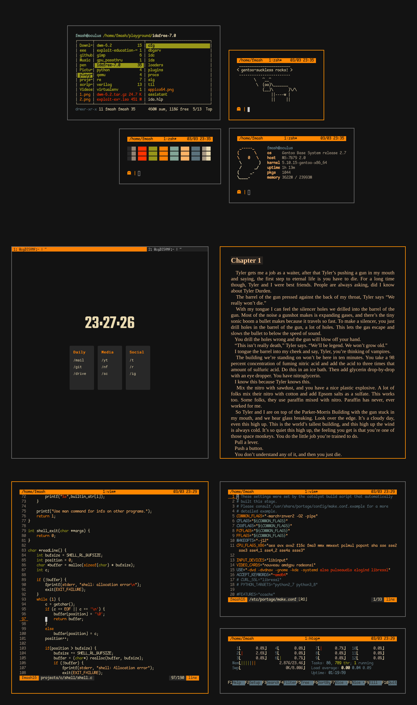

<p align="center">
    
</p>

These are the different configurations for my desktop rice and builds of my window
manager and terminal. My current configuration is:

* **WM:** dwm
* **Terminal:** st
* **Shell:** zsh
* **Font:** Iosveka Term
* **Compositor:** picom
* **File Manager:** ranger
* **PDF Viewer:** zathura
* **Browser:** suckless surf with tabbed.
* **Terminal Multiplexer:** tmux



# Setup

CLone the repo and issue the following commands to apply the rice

```bash
git clone https://github.com/fmash16/dotfiles
cp -rv dotfiles/* ~/

cd ~/.config/dwm && sudo make clean install
cd ~/.config/st && sudo make clean install

cd ~/ && xrdb .Xresources
```

Install the following packages on the distro:
  1. ranger
  2. zathura pdf viewer
  3. picom
  4. tmux
  5. zsh (oh-my-zsh)
  6. vim


## Firefox custom CSS

Enable userChrome customization in about:config

* Navigate to about:config in the address bar and accept the risks.

* Search for toolkit.legacyUserProfileCustomizations.stylesheets and
  toggle it to true (by double clicking on it).

### Locate and open your profile folder

Either of the following two methods work:

* Using the Firefox troubleshooting page Click on ☰ ➝ Help ➝ Troubleshooting Information or navigate to about:support in your address bar Under Application Basics, click on the the Open Folder button. You should now see your profile folder.

* Using the Firefox command line Press Shift+F2 Enter the command folder openprofile

### Create the folder and its files

* Inside your profile folder, create a new folder named chrome (all lower case) - the chrome folder should end up in a folder that includes stuff like prefs.js and places.sqlite

* Inside the chrome folder, copy the files ```userChrome.css``` and ```userColors.css```
  from the firefox_css folder.
